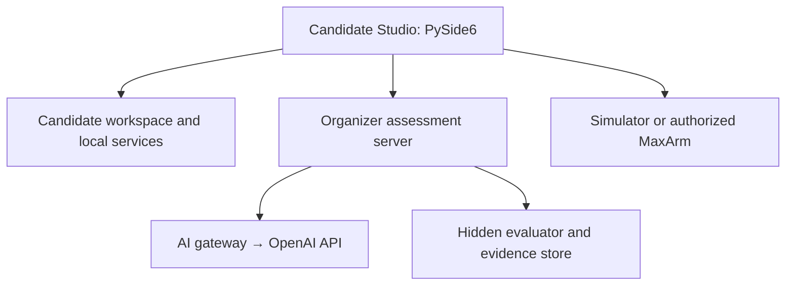

# AI Engineering Assessment Studio — Architecture v1

**Status:** implementation baseline for review · **Date:** 26 September 2026  
**Scope:** Windows training and five-hour competition workstation, organizer services, simulator, and physical MaxArm integration.

## 1. Purpose and boundaries

Build one coherent application for the date-fruit AI Engineering workflow: inspect and prepare a four-class dataset; train and compare YOLO models; view a live camera and processed detections; calibrate pixel-to-robot positions; test a robot simulator; edit and run Python; consult an AI assistant; and submit verifiable assessment evidence. Training mode and assessment mode share the same core services but use different permissions and organizer controls.

The **five-hour assessment scheme** calls for four distinct training experiments, model selection, camera configuration, application/simulator integration, optional dynamic pickup, and final physical sorting. Its thresholds and stage timing are provisional until a hardware pilot. The existing PySide6/other prototypes are migration inputs, not evidence that these features already form an integrated application.

### Decisions already reflected in this baseline

| Concern | Baseline |
|---|---|
| UI | PySide6 desktop app; readable, light theme; raw camera, processed/annotated view, robot view, editor, and output panes |
| Development language | Python, with a pinned and tested Windows environment for the official image |
| Dataset | Original organizer dataset mounted read-only; derived candidate subset and outputs in candidate workspace |
| Model | Ultralytics YOLO behind a versioned inference/training adapter; approved weights cached before the event |
| Calibration | 2×3 affine or 3×3 projective mapping with click-to-test, magnified cursor view, and saved geometry metadata |
| Robot | Common command API with simulator and real MaxArm adapters; physical motion explicitly armed and supervised |
| IDE | Embedded editor plus process-backed terminal; Monaco via Qt WebEngine is an option after a small packaging proof |
| AI | Student UI calls organizer gateway; server owns API key, usage accounting, and retained transcript |
| Evidence | Candidate events and artifacts sent to organizer service; scoring and hidden tests remain organizer-owned |

## 2. System topology



**Trust boundary:** the competitor can edit and execute Python. The desktop app cannot enforce Internet isolation. The competition Windows image, account policy, dedicated network/firewall, and server authorization enforce access. The local audit log is useful telemetry; server receipt and artifact hashes provide authoritative assessment evidence. A candidate PC must never hold the OpenAI key or hidden scoring data.

The simulator must be reachable through the same documented HTTP contract as the robot. A shared physical robot needs serialized, supervised booking; a robot command is never treated as completed merely because the HTTP request was sent.

## 3. Modules and service ownership

| UI module | Candidate operation | Service / boundary |
|---|---|---|
| Home | Session, stage, deadlines, connectivity, alerts | SessionService |
| Dataset | Browse classes/images/annotations, select four, create subset, printable specimens | DatasetService, read-only source adapter |
| Training | Configure four runs, start/stop, compare metrics and checkpoints | TrainingService, process supervisor |
| Vision | Raw stream, ROI/process preview, detections and centers | CameraService, InferenceService |
| Calibration | Select points, choose transform, click test, inspect magnifier | CalibrationService |
| Robot | Simulator scene/state, positions, health, suction, sequence trace | RobotService and transport adapter |
| IDE | Tree, tabs, save, run/stop, output and terminal | WorkspaceService, ExecutionService |
| AI Assistant | Ask, selected code, error or result context, allowance display | GatewayClient; never a direct provider key |
| Results | Candidate-visible metrics and simulator outcomes | ResultService; organizer hidden scores gated |
| Submission | Manifest preview, validation, final lock/receipt | SubmissionService and organizer server |

UI modules communicate through typed application events and shared services, never by importing another module's widget. Camera capture, inference, training, network requests, PDF export and Python execution run off the Qt UI thread with cancellation and bounded queues. A stale frame can be dropped; an audit event cannot.

### Shared contracts (initial draft)

```python
Detection = {
    "class_id": 2, "class_name": "Ajwa", "confidence": 0.94,
    "bbox_xyxy": [800, 390, 884, 442], "center_px": [842, 416],
    "frame_id": "...", "captured_at": "...", "coordinate_space": "full_frame"
}

RobotMove = {"command": "move", "location": "P1", "height": "high", "duration_ms": 1500}
RobotSuction = {"command": "suction", "state": "on"}
```

The class ID is a dataset/model label and is **not** implicitly a robot position. The candidate's locked `class_to_destination` mapping determines the tray. The full-frame center is computed from the inference ROI by adding ROI offsets (and reversing any resize or display scaling) before calibration. The raw image is preserved; brightness/contrast changes used for inference and annotation are identified separately.

## 4. Candidate workspace and source data

```text
C:\AIEngineering\
  organizer\dataset_original\       # OS enforced read-only; outside candidate tree
  candidates\C014\
    session.json                  # public session metadata; no secret signing key
    project.json                  # mode and references to approved source dataset
    dataset\                    # selected four-class working copy and data.yaml
    src\                        # student Python files
    models\                     # run_01..run_04, selected model
    camera\                     # settings, ROI, reproducible image pipeline
    calibration\                # points and transforms
    results\                    # visible evaluation and simulator results
    exports\                    # candidate-generated images/PDFs
    logs\                       # local JSONL queue, training output
    submission\                 # immutable snapshot after final lock
```

Paths are resolved and validated at service boundaries; a candidate import/export must not silently overwrite the source dataset or cross into another candidate workspace. Store large model weights, original date images, generated exports and Python environments outside Git. Record dataset version, source manifest/hash, class names/order, split, annotation type, and source-to-derivative provenance. Keep hidden evaluation images exclusively on the organizer side; do not put them in the client or its installer.

Dataset adapters must read YOLO detection labels and segmentation polygons explicitly. The existing printable-image utility uses polygons where available and rectangular masks for box-only annotations, which must be labeled honestly in the UI. Subset creation must remap selected original class IDs to a contiguous four-class mapping and update labels and `data.yaml` consistently. Freeze selection before assessed training.

## 5. Vision and calibration

**Camera pipeline:** capture frame → immutable frame ID/raw preview → select full-frame ROI → apply declared software correction → run inference → map detections back to full-frame pixels → draw annotated preview → optionally transform center → candidate-controlled robot action. Persist camera index/backend, requested and read-back properties, resolution, exposure, focus, white balance, ROI, brightness/contrast, model hash and threshold. A driver can ignore requested properties; surface actual values and verification status. No automatic robot move merely from viewing a detection unless a tested candidate workflow explicitly enables it.

**Calibration:**

- 2×3 affine matrix maps `[u, v, 1]` to robot `[x, y]`; require at least three non-collinear correspondences.
- 3×3 homography maps homogeneous image coordinates and divides by the third component; require at least four non-collinear correspondences and reject degenerate fits.
- Persist transform kind, matrix at full numeric precision, source and destination points, image width/height, camera/ROI profile, physical robot frame/unit, timestamp and version. Display two decimals in the UI; retain precision in JSON.
- A click after fitting defaults to test mode and displays large integer robot X/Y. Magnifier aids corner selection. A stored transform is invalidated or explicitly rechecked when resolution, crop geometry or camera mounting changes.
- Guard workspace bounds and unreachable robot poses. XY mapping alone does not define Z, pickup approach or motion safety.

The assessment scheme allows a fixed-point pickup path; dynamic pickup requires a validated transformation and unseen-position test. The UI should show which path is active, without claiming calibration accuracy from the fit alone.

## 6. Robot protocol and motion safety

The **stored MaxArm API v0.5.1** documents `GET /health`, `/health/deep`, `/positions`, `/suction`, and `POST /command`. Its accepted move body uses `location: P1..P5`, `height: high|low`, optional `duration_ms` (100–10000; default 1000). Suction uses `state: on|off`. It does **not** document a coordinate-based move, `home`, or software emergency stop. A later conversation requested XYZ moves; treat that as a proposed extension until the live firmware and simulator are inspected and contract-tested.

Create `RobotClient` capabilities (`positions`, `suction`, optional `cartesian_move`, optional `stop`) with a version/capability query. The simulator and real adapter both conform to the supported subset and response/error codes. Do not expose a Cartesian control as operational on the real arm until firmware and reachability rules support it. The simulator renders current and target pose, motion progress, suction state, command log, and injected 409/timeout/5xx faults. It provides the same `/command` HTTP behavior used by student `requests` code.

Physical motion requires an explicit operator enable plus valid bounds, one command at a time, timeout handling, and an external physical emergency-stop/power isolation method. Plan routes through a high clearance pose before crossing trays; reject or review unsafe low-to-low transitions. A failed or ambiguous response halts the sequence and awaits status/approval; never blindly resend a potentially executed move. Avoid `/health/deep` polling during motion.

## 7. Training, IDE, and execution

TrainingService records four distinct configurations, dataset and base-weight hashes, command/arguments, environment manifest, process start/end, run ID, logs, metrics, checkpoint hashes, and completion status. The candidate can compare mAP50, mAP50-95, precision/recall, confusion matrix, loss curves, latency and per-class performance. The selected production model must match one recorded run hash; organizer evaluator independently runs hidden tests. A candidate may continue a run only under an explicit rule identifying whether it counts as a distinct experiment.

The editor opens only candidate files for save; Monaco + Qt WebEngine is a proposed implementation, subject to Windows packaging and offline asset testing. A simpler native Qt code editor may serve the first milestone. ExecutionService uses a pinned local Python interpreter, a child process with stdout/stderr capture, process-tree stop and resource/status reporting. The terminal is a genuine process-backed console for the candidate workspace; UI controls are not a security sandbox. Avoid putting secrets in child environment variables. Log execution events without intercepting passwords or typing in unrelated apps.

## 8. Assessment server, audit, AI gateway

**Identity:** organizer issues anonymous competition-day token and short PIN; server validates and maps token to one candidate session. The private identity mapping stays server-side. Session nonce, stage locks and server timestamps bind training and submission evidence. A signed event verifies origin/integrity only when signed by a server-controlled key; client-authored timestamps or hashes alone do not prove training time.

**Event envelope:** `event_id`, `schema_version`, candidate/session/run ID, client/server timestamps, sequence number, event type, outcome, relevant artifact hashes and compact payload. Append events locally for resilience; send idempotently to server, record acknowledgment, flag gaps and clock drift. Proposed event families: activation, class lock, train run lifecycle, model selection, camera/calibration saved, inference test, robot command/result, AI request/result/usage, simulator test, submission lock. Avoid streaming every camera frame; store selected sampled evidence with consent and retention rules.

**Server data:** sessions, class selections, experiments, artifacts, audit events, AI conversations/usage, simulator trials, scoring runs and submission receipts. SQLite is suitable for a single workstation prototype; choose a centrally backed DB before multi-station competition. Content-addressed artifact storage with SHA-256 manifest and a final immutable snapshot supports repeatable scoring. The hidden evaluator and score engine run on the organizer server with versioned benchmark rules and published criteria; provisional thresholds need pilot calibration.

**AI:** client sends authenticated question and explicitly selected context (code/error/metric) to gateway. Gateway constructs prompt, invokes approved model, records request and response, token usage, candidate ID and server time, and returns bounded output. No web or external tools in assessment mode unless formally approved. Key and provider billing live on the server. Implement a server-side shared budget with reserved maximum cost per in-flight request, per-candidate quotas, concurrency control and graceful quota/exhaustion UI; provider billing may lag and must not be treated as an instantaneous hard stop. Prompt content may contain student code, so define retention, access and redaction policy before the event. Training mode may use a configurable gateway or a local demo stub.

## 9. Modes, permissions, and stages

| Feature | Training | Assessment |
|---|---|---|
| Dataset | Practice version; selectable experiments | Approved source; exactly four classes locked |
| Simulator | Free practice, reset/fault exercises | Logged official trials and stage policy |
| Physical robot | Supervised development where available | Scheduled supervised final trials |
| AI | Practice guidance | Central gateway, logged and quota controlled |
| Model metrics | All practice metrics | Candidate visible metrics; hidden scores server-side |
| Submission | Export snapshots | Server receipt and final lock |

The default flow is activation/class lock → four recorded model runs → evaluation/selection lock → camera and simulator integration → spatial check → supervised robot trial → final submission. Stage windows in the assessment PDF are planning values, not baked into code. Organizer policy config determines timing, allowed features, extensions and accommodations. Training and assessment share contracts, but training projects must never be promoted into a live candidate workspace as signed competition evidence.

## 10. Repository layout and migration

```text
ai-engineering-assessment-studio/
  README.md  AGENTS.md  pyproject.toml  .gitignore
  docs/ARCHITECTURE_V1.md  docs/SOURCE_INVENTORY.md
  src/ai_assessment/
    app.py
    core/              # settings, typed events, models, workspace
    services/          # dataset, camera, inference, calibration, robot, execution, AI client
    modules/           # UI pages; no direct cross-page imports
    simulator/         # HTTP API and renderer
  server/              # future organizer gateway, audit and scoring
  tests/               # contracts and meaningful integration scenarios
  legacy/              # copied original prototypes, clearly labeled/versioned
```

Preserve source prototypes unchanged on import to `legacy/`, then extract services one at a time. Do not commit source archives and duplicated extracted copies together. Keep the physical robot firmware in its own versioned directory/repository once supplied. The starter package intentionally omits application code and source dataset until the baseline and provenance are confirmed.

### Milestones and acceptance gates

| Milestone | Deliverable | Acceptance demonstration |
|---|---|---|
| M0 | Spec, source inventory, Git baseline | Reviewed contracts, imported originals with provenance |
| M1 | PySide6 shell, candidate workspace and events | Navigate pages; reopen same workspace; append/ack events |
| M2 | Calibration pilot | Load still frame/camera; affine/homography fit, click test, save/reload |
| M3 | Dataset | Read-only originals; four-class export, labels/YAML remapped and counted |
| M4 | Vision | Raw and annotated streams; ROI and center mapping; nonblocking stop |
| M5 | Simulator and robot adapter | Same documented move/suction tests; fault and busy handling |
| M6 | Training/results | Four runs and metrics; hashes; select one production model |
| M7 | IDE/terminal | Edit/save/run/stop isolated candidate files; captured output |
| M8 | AI gateway | Authenticated chat and selected context; audited usage and quota exhaustion |
| M9 | Assessment/submission | Token activation, locks, evidence receipts, hidden scoring and official trials |
| M10 | Security and event rehearsal | Pilot on actual Windows image, network, GPU, camera, simulator and MaxArm |

Meaningful contract tests cover ROI/full-frame conversion; annotation remapping; affine/homography fit and reload; simulator/physical response compatibility; retry safety; run evidence/manifest hashes; server idempotence and quota concurrency. End-to-end pilot measures five-hour feasibility, GPU runtime, scoring thresholds and physical robot safety.

## 11. Source inventory and unresolved decisions

This version was grounded in the current stored `MaxArm_API(2).md` (v0.5.1), `date_yolo_class_detector_http_high.py`, `date_dataset_image_extractor_maxfit_pdf.py`, `MaxArm_Visual_Simulator.zip`, `RobotPositions.xlsx`, and `AI_Engineering_5_Hour_Assessment_Scheme.pdf`, plus the project discussions. The latest calibration UI source, current coordinate-capable firmware, original Roboflow export, and a general dataset manager were not confirmed as locally available in this starter. Import them only after obtaining the actual files and recording their versions.

Decide before M5/M9: exact XYZ request/response and units; actual MaxArm reachable volume and stop behavior; whether the robot is shared; approved YOLO/weights and GPU image; four-run continuation rule; fixed vs dynamic pickup scoring protocol; AI model and retention/access policy; session outage handling; final competition thresholds. Until decided, maintain these as configurable proposals rather than hard-coded facts.
