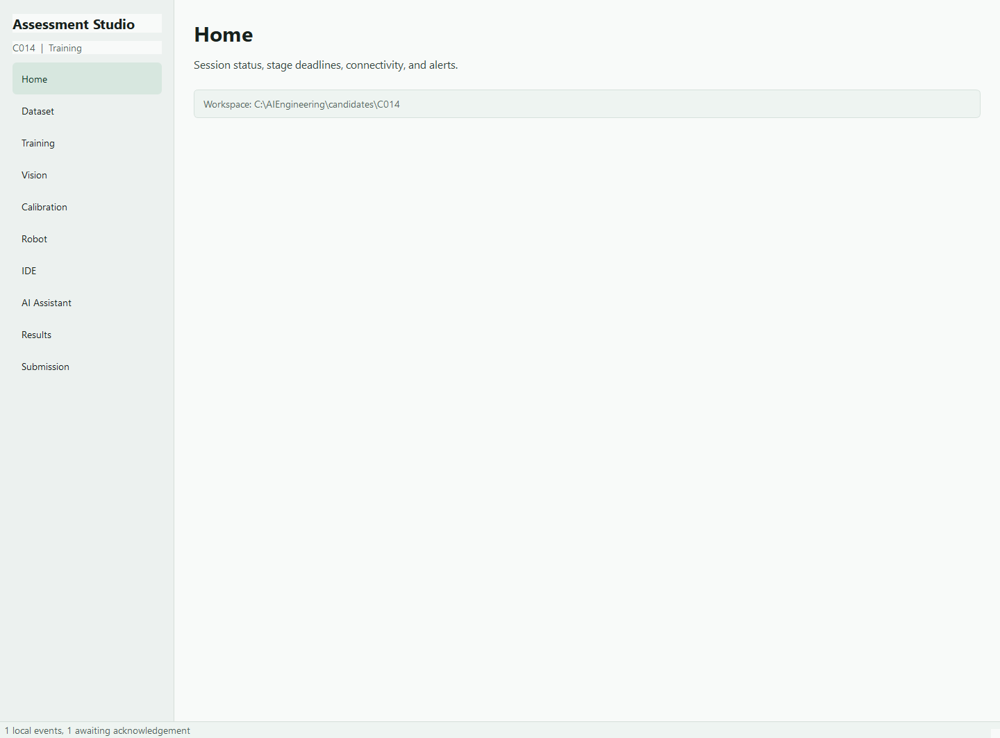
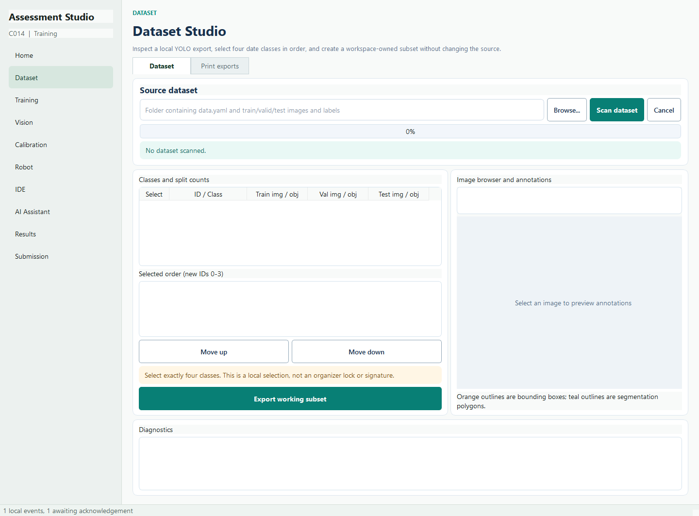
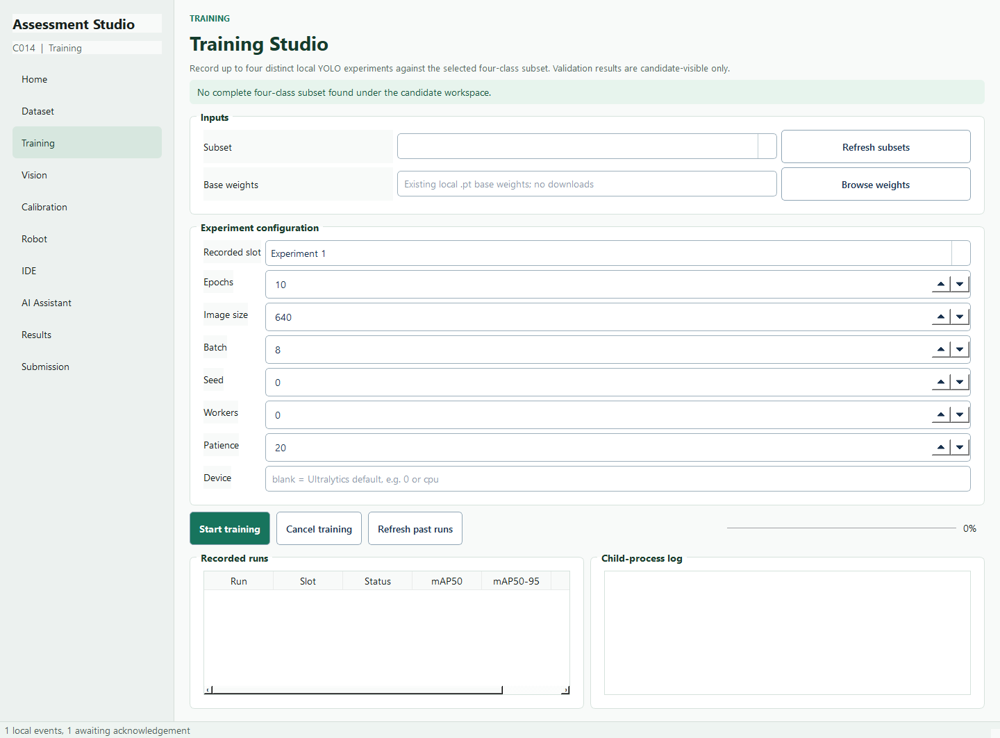
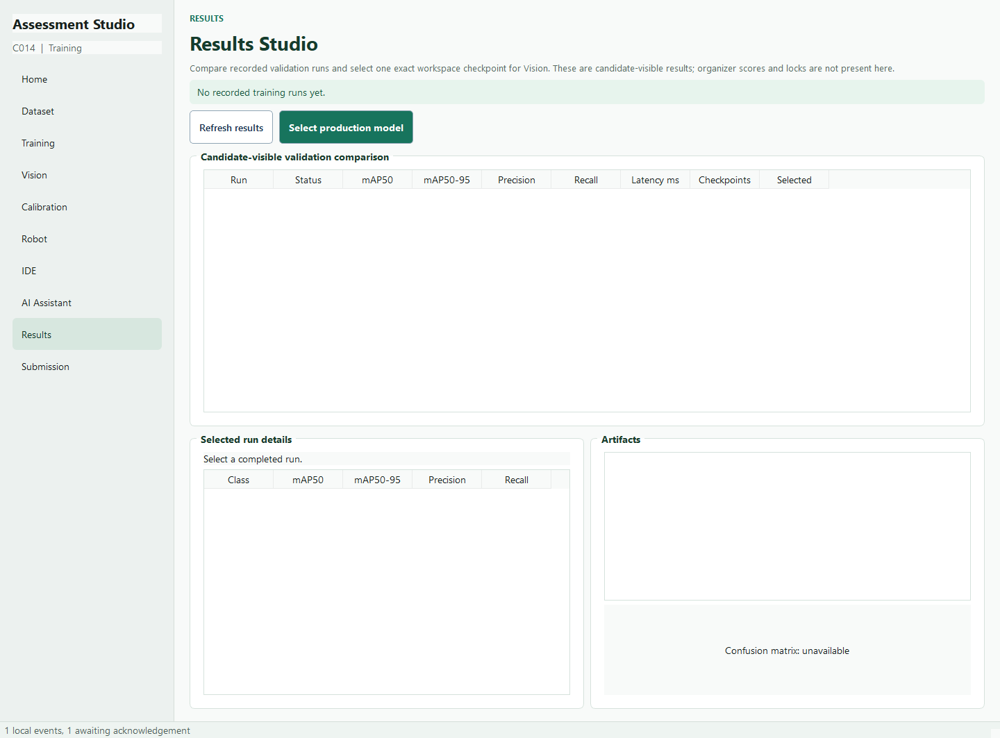
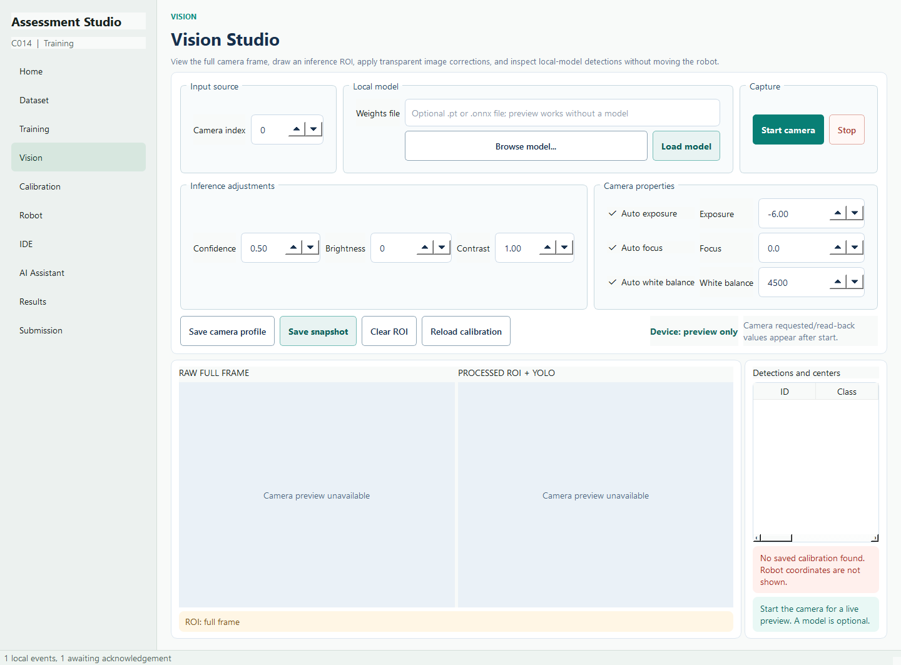
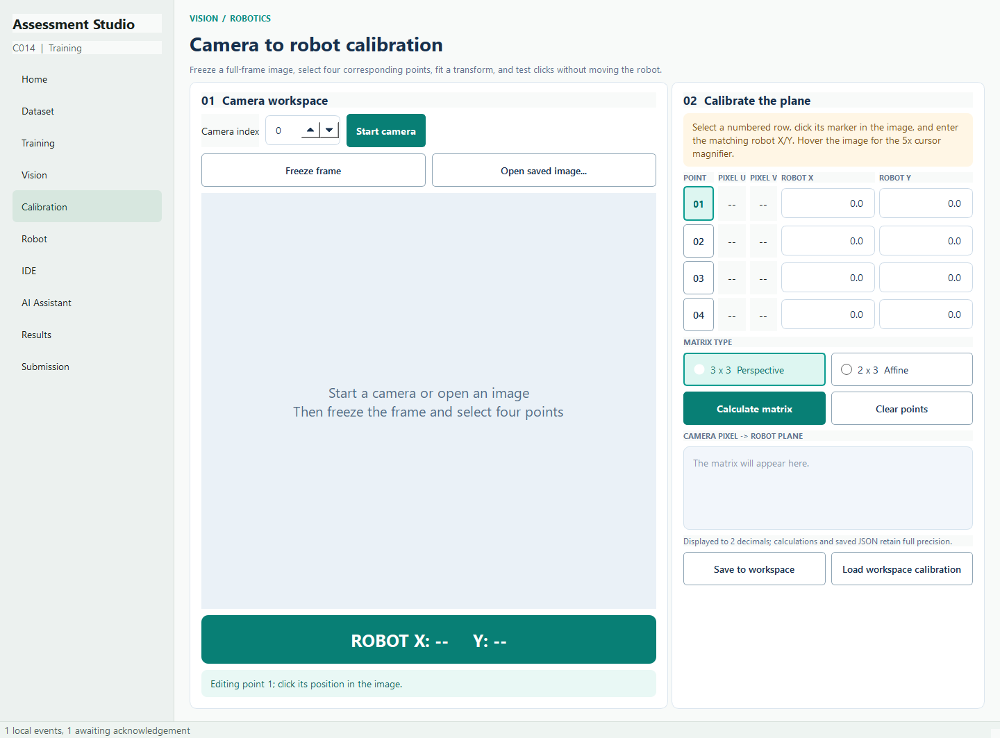
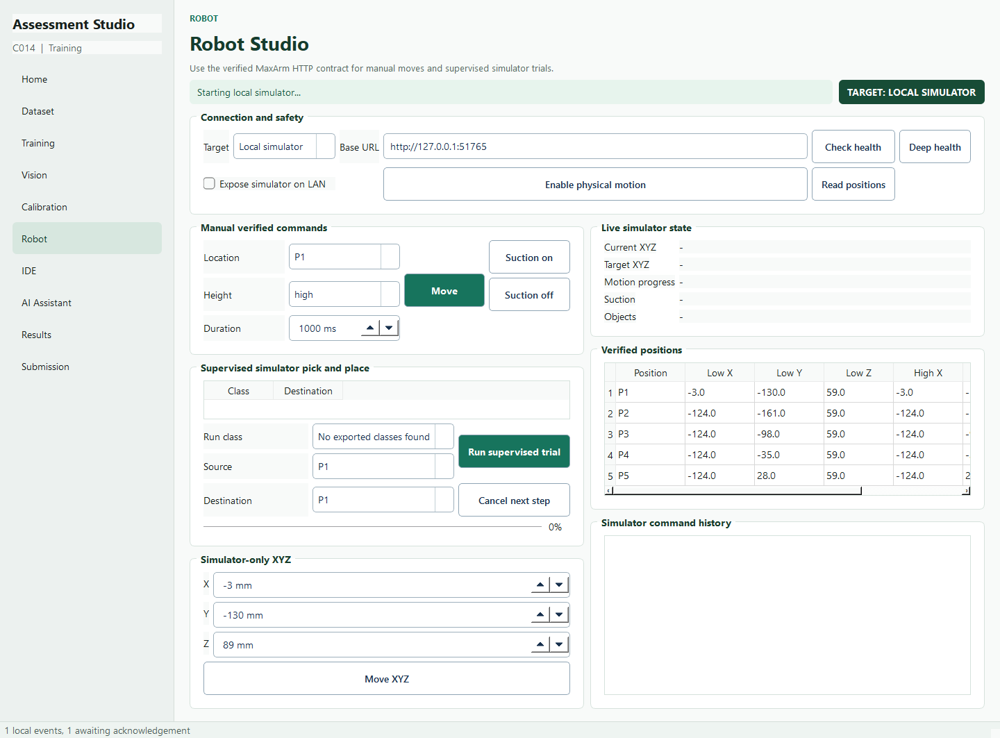
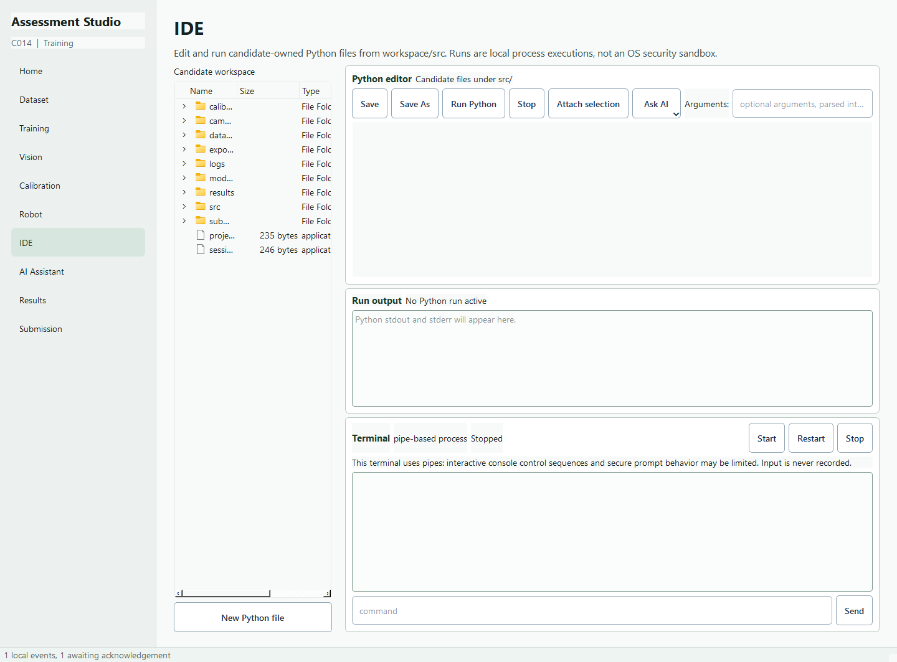
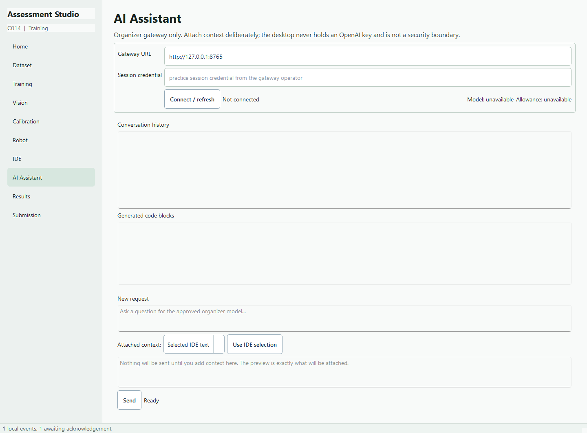

# Student Visual Guide

This guide explains the normal workflow in AI Engineering Assessment Studio. The screenshots show the application in a clean practice workspace; a real dataset, camera, model, or robot will add more information to the same pages.

## Start Here

Open a Windows PowerShell prompt in the project folder:

```powershell
conda activate ai-assessment-studio
python -m ai_assessment.app
```

For an existing workspace, omit `--candidate-id` unless you are deliberately checking it against `session.json`. The application keeps candidate-owned files inside the workspace and records important actions in the local event log.



The sidebar is the main navigation. The bottom status bar shows local event activity. Start with **Dataset**, then continue through Training, Results, Vision, Calibration, Robot, and IDE as needed.

## Recommended Order

1. Prepare the four-class dataset.
2. Run and compare local training experiments.
3. Select a completed production checkpoint.
4. Configure the camera and test detections.
5. Save calibration only after the camera geometry is stable.
6. Practice robot commands in the simulator.
7. Use the IDE for candidate-owned scripts.
8. Use the AI Assistant only when the gateway is configured and context is intentionally selected.

## Dataset



1. Enter the folder that contains `data.yaml` and the train, validation, and test folders.
2. Press **Scan dataset**. Read diagnostics before exporting anything.
3. Select exactly four classes and use **Move up** and **Move down** to set their order.
4. Review the image and annotation browser. Boxes and polygons are shown on the image when labels are valid.
5. Press **Export working subset**. The application copies a remapped, workspace-owned subset and leaves the original dataset read-only.
6. Use **Print exports** only when physical specimen cards are needed. Box-only labels are reported as rectangular cutouts.

The export keeps split membership, remaps selected classes to IDs 0 through 3, and writes a manifest with counts and file hashes. Mixed-class images are excluded rather than silently losing annotations.

## Training



1. Choose the exported four-class subset.
2. Browse to an existing local `.pt` base-weight file, or type an official detection name such as `yolo26n.pt`. On **Start training**, the app downloads a missing official model to `models/base_weights/` when the competition network allows it and reuses the cached file on later runs.
3. Choose one experiment slot and set its parameters, seed, device, and epochs. AMP is off by default so training does not need an extra model download for the AMP check; GPU training still works in full precision. Enable AMP only if the network or local Ultralytics weights cache supports that check.
4. Press **Start training**. The UI remains responsive while the child process runs.
5. Follow the live output and status. **Cancel training** keeps the run record and logs, but it is not counted as a completed experiment.
6. Repeat with four distinct configurations when the assessment workflow requires four experiments.

Training uses the validation split for candidate-visible evaluation and preserves the test split for later evaluation. Generated files stay under the workspace `models/`, `results/`, and `logs/` folders.

## Results



Use Results to compare recorded runs. Metrics are shown only when they were produced by the evaluator; unavailable values are labeled as unavailable. Select a completed checkpoint with **Select production model**. The selection records the run identity and exact checkpoint hash for Vision and later work.

These are candidate-visible validation results. They are not hidden organizer scores or a server lock.

## Vision



### Prepare the camera

1. Set the **Camera index**.
2. Optionally choose a local `.pt` or supported `.onnx` model and press **Load model**. Preview works before a model is loaded.
3. Press **Start camera**. The device label and requested/read-back values update when the driver responds.
4. Adjust confidence, brightness, and contrast for the inference image.
5. Leave automatic exposure, focus, and white balance enabled unless the camera setup calls for manual values.

### Use the image area

- The left image is the untouched full camera frame.
- Drag on the raw image to draw an inference ROI.
- The right image shows the processed ROI and YOLO annotations.
- Detection rows contain class, confidence, full-frame bounding box, frame ID, and full-frame center pixels.
- Robot X/Y appears only when a saved calibration matches the current full-frame geometry.

**Save camera profile** stores settings. **Save snapshot** stores raw, processed, and metadata evidence. **Clear ROI** returns to the full frame. Camera clicks never move the robot.

## Calibration



1. Start the camera or open a saved image.
2. Freeze the frame before selecting points.
3. Select four corresponding camera and robot points. Use the magnifier for precise image clicks.
4. Choose affine or homography, then press **Calculate matrix**.
5. Review the matrix and click the image to test a predicted robot X/Y.
6. Press **Save to workspace** only after checking the geometry and coordinate convention.

Calibration is a coordinate prediction tool. It never sends a robot command, and a geometry mismatch prevents downstream robot-coordinate use.

## Robot



1. Start with **Local simulator**.
2. Press **Check health** and **Read positions** before trying a move.
3. Use high poses for travel and low poses only at a source or destination.
4. Use **Suction on** and **Suction off** deliberately.
5. Map each selected class to a destination position before running a supervised trial.
6. Use **Run supervised trial** to exercise the complete high-clearance pick-and-place sequence.

The physical MaxArm starts disarmed. It requires explicit operator enabling and successful health/position checks. The physical emergency stop and power isolation remain outside the software. Live Vision detections never trigger sorting automatically.

## IDE And Terminal



1. Double-click a candidate file in the workspace tree.
2. Press **New Python file** for a new script. New files default to `workspace/src/`.
3. Use **Save** or **Save As**. The application rejects paths outside the candidate workspace and does not edit the original dataset or repository source.
4. Press **Run Python** to execute the saved file. Output and tracebacks appear in **Run output**.
5. Use **Stop** only for the IDE run. It does not stop Training.
6. Start the pipe-based **Terminal** for interactive commands, restart it when a session needs a clean process, and send commands through its input field.

Candidate code can import workspace code, inspect local results, and call the local simulator address. Running code is not an operating-system security sandbox, and it never automatically arms the physical robot.

## AI Assistant



1. Enter the organizer gateway URL and the session credential supplied for the environment.
2. Press **Connect / refresh** to check the model and remaining allowance.
3. Choose the context type and inspect the exact context preview.
4. Write a question and press **Send** deliberately. The client never calls OpenAI directly.
5. When a response contains code, each fenced block is listed separately. Use **Send to IDE** on the specific block you want.
6. Choose **New file**, **Insert at cursor**, or **Replace selection**. Review the replacement diff when offered.

AI-generated code opens as an unsaved draft. It is never saved or run automatically. Requests, selected context hashes, handoffs, and response IDs are recorded without putting raw code into compact local handoff events.

## Submission

The Submission page is reserved for the later organizer-controlled assessment flow. Do not treat local events, candidate-visible metrics, or simulator results as a server receipt or official score.

## Visual Cues

- Teal filled buttons are the primary action in a page.
- White outlined buttons are normal actions such as Browse, Save, Clear, or Reload.
- Red outlined buttons are stop or caution actions.
- Amber panels are hints or geometry warnings.
- Green panels are status or successful-state information.
- Disabled controls are unavailable until the prerequisite state is ready.

When in doubt, read the status message below the control group before repeating an action. Slow operations such as scanning, training, camera capture, model loading, network calls, and Python execution run outside the Qt UI thread.
